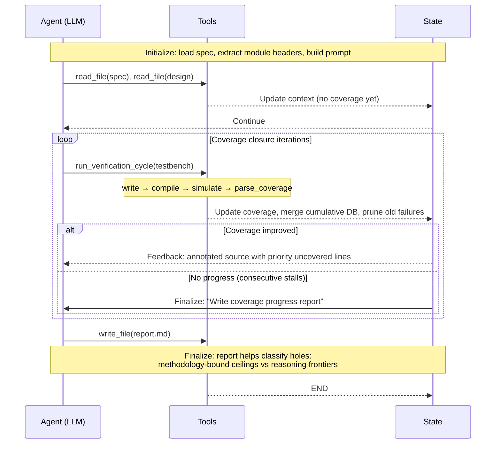

Chip verification is where schedules go to die. A design can be architecturally brilliant, pass every code review, and still spend months stuck in a loop of testbench refinement, coverage analysis, and "why isn't this branch getting hit?" According to the [2024 Wilson Research Group study](https://blogs.sw.siemens.com/verificationhorizons/2025/09/03/why-first-silicon-success-is-getting-harder-for-system-companies/), 60-70% of engineering effort in chip projects goes to verification, and only 14% of ASIC/SoC projects achieved first-silicon success last year. The bottleneck isn't writing tests. It's closing coverage.

We built [CovAgent](https://github.com/AAISHAA/CovAgent) to do this autonomously. It's an agentic framework that reads a design specification, generates SystemVerilog testbenches, runs simulations, parses coverage reports, and iterates. No human in the loop. The goal: full code coverage closure, driven by LLM-powered agents orchestrated through [LangGraph](https://github.com/langchain-ai/langgraph).

Here's what we found.

<!-- IMAGE 1: CovAgent high-level overview diagram showing inputs (Design Specification, Design Files, Target Coverage Model) feeding into the CovAgent framework box, with outputs (Test Cases, Coverage Hole Taxonomy & Exclusion Lists, Token Allocation Study). Clean, minimal. Alt text: "CovAgent framework overview: design inputs on the left, agentic processing in the center, coverage and analysis outputs on the right" -->

## Prior Work and Where This Fits

The idea of using LLMs for hardware isn't new. [ChipNeMo](https://arxiv.org/abs/2311.00176) showed that domain-adapted LLMs can outperform GPT-4 on chip design tasks. On the verification side, [ChiRAAG](https://arxiv.org/abs/2402.00093v3) uses ChatGPT for iterative assertion refinement, [LLM4DV](https://arxiv.org/abs/2310.04535) demonstrated LLM-driven stimulus generation from functional coverpoints, and [VerilogReader](https://arxiv.org/abs/2406.04373) approaches coverage-centric test generation by feeding design code directly to the LLM. More recently, multi-agent systems like [MAGE](https://arxiv.org/abs/2412.07822) tackle RTL code generation by decomposing the task across specialized agents, and [Saarthi](https://arxiv.org/abs/2502.16662) applies agentic AI to formal verification with end-to-end property generation and proving.

These works demonstrate feasibility. But they leave gaps. Most don't tackle automated coverage closure from specifications, which is how verification engineers actually work. None systematically analyze where inference-time tokens go during agentic verification, or classify why certain coverage holes remain stubbornly unclosed. And very few evaluate on designs large enough to represent real unit-level verification.

## The Architecture

CovAgent implements a [ReAct](https://arxiv.org/abs/2210.03629) (Reasoning + Acting) loop as a LangGraph state graph. The agent has access to purpose-built verification tools: file operations for reading specs and writing testbenches, simulator tools that compile and run designs through QuestaSim, and analysis tools that parse coverage databases to identify exactly which lines remain uncovered.

The workflow mirrors what a verification engineer does on day one. The agent reads the specification. It generates a testbench with constrained random stimulus. It compiles, simulates across multiple random seeds, merges coverage, and examines what's missing. The annotated source shows which lines were hit and which weren't. The agent reasons about the gaps, writes a targeted testbench, and the loop continues.

State management is filesystem-centric. Testbenches, simulation logs, coverage databases all live on disk. The LangGraph state tracks metadata only: iteration count, current coverage percentage, file paths. This keeps the agent's context window focused on reasoning rather than carrying around large artifacts. We also built a composite tool that chains write, compile, simulate, and parse into a single atomic call, cutting each iteration from 4-5 LLM round-trips to one.

<!-- [CovAgent interactive workflow](/artifacts/covagent_workflow_stepper.html) -->
<!--  -->

<!-- IMAGE 2: LangGraph state graph showing nodes: Initialize → Agent → Tools → Update State, with conditional edges: "continue" back to Agent, "coverage complete / no progress" to Finalize → Agent → END, and "hard limit" to END. Clean node-and-edge diagram. Alt text: "CovAgent LangGraph state graph with initialize, agent, tools, update state, and finalize nodes forming an iterative loop with conditional termination" -->

## Peeking into Token Utilization

One of the more revealing parts of this work was instrumenting the system to track token allocation across six categories: system prompt, design comprehension, stimulus generation, coverage feedback, error recovery, and agentic overhead. This kind of profiling, inspired by research on [scaling inference-time compute](https://arxiv.org/abs/2408.03314), tells you what the agent is actually spending its reasoning budget on.

The headline number: only 12-18% of tokens produce actual testbench code. Everything else goes to comprehension, reasoning, feedback processing, and infrastructure. The agent spends far more time thinking about the design than writing tests for it.

This gets worse with scale. Small designs (under ~800 lines) converge to 100% coverage within 10K-30K tokens. Large designs (2000-8500 lines) need 55K-175K tokens and plateau at 96-99%. Reasoning effort per line of code grows superlinearly. Small designs need roughly 0.1-0.3 reasoning tokens per LOC. Large designs need 4-8. Comprehension is the real bottleneck, not code generation.

We validated this by comparing our domain-specialized LangGraph agent against a general-purpose [Codex](https://arxiv.org/abs/2107.03374) baseline using the same underlying model (GPT-5.2). The LangGraph agent achieved equal or higher coverage while using 4-13x fewer tokens. The savings came from eliminating unproductive exploration: environment setup, file discovery, ad-hoc coverage parsing. Domain specialization doesn't make the model smarter. It stops the model from wasting time. ChipAgents makes a [similar argument](https://chipagents.ai/blogs/ai-agents-verification) about why domain-specialized agents will replace traditional verification workflows.

## Not All Coverage Holes Are Created Equal

When coverage plateaus below 100%, the natural question is: why? We classified every residual hole across our 19 benchmark designs into a taxonomy with two categories.

**Methodology-bound ceilings** are holes that no amount of stimulus can close. Internal signals hardwired at the integration level. FSM defaults that exist as defensive code. Debug paths never activated in normal operation. These are exclusion candidates, not agent failures.

**Reasoning frontiers** are holes the agent could theoretically close but doesn't. Protocol sequencing complexity, where the agent needs to construct bus functional models for Wishbone or CAN protocols. Multi-module pipeline warmup requiring coordinated activation across deep hierarchies. Narrow timing windows demanding cycle-precise alignment.

The split is telling. On simple designs, almost all residual holes are methodology-bound. On complex designs like the Ethernet MAC or CAN controller, reasoning failures dominate. The agent correctly *diagnoses* what needs to happen (build a Wishbone burst model, generate bit-stuffed CAN frames) but fails to *implement* the solution in synthesizable SystemVerilog. The gap between diagnostic and generative capability is one of the clearest findings of this work, and it directly informs where multi-agent architectures can help.

<!-- IMAGE 3: Coverage curves plot showing coverage (%) vs cumulative tokens on a log scale, with small designs converging steeply to 100% and large designs plateauing at 96-99%. Multiple colored curves grouped by design size. Alt text: "Coverage convergence curves showing small designs reaching 100% quickly while large designs plateau at 96-99% coverage with diminishing returns" -->

## What This Points Toward

The token allocation data and coverage hole taxonomy both point in the same direction: a single agent doing everything is not the right architecture for complex designs. This aligns with the broader push toward multi-agent systems in chip design. NVIDIA's [MARCO framework](https://developer.nvidia.com/blog/configurable-graph-based-task-solving-with-the-marco-multi-ai-agent-framework-for-chip-design/) uses graph-based multi-agent task solving for design automation. ChipAgents argues that [structured disagreement between specialized agents](https://chipagents.ai/blogs/multi-agent-debate-chip-design), grounded by EDA tool oracles, is the path forward.

We're building toward a similar decomposition for verification. Specialized agents for design comprehension, stimulus generation, and coverage analysis, coordinated by an orchestrator. The design expert accumulates RTL knowledge persistently across a run instead of re-reading the design every iteration (addressing that superlinear comprehension cost). The stimulus generators are ephemeral workers: given a target, generate a testbench, done. Coverage merging happens at the framework level.

The reasoning frontier categories map directly to what needs improving. Protocol sequencing failures need agents with deeper domain knowledge or access to reference BFM implementations. Pipeline warmup failures need agents that can reason about multi-module coordination with a persistent understanding of the design hierarchy.

The simulator remains the oracle. Coverage is the ground truth. The agents can reason and debate, but the tools decide. That constraint is what keeps the whole system honest.

---

<!-- *CovAgent is an open-source project developed at Arizona State University's [ADVENT Lab](https://faculty.engineering.asu.edu/aman-arora/advent-lab/), under Dr. Aman Arora. Built on [LangGraph](https://www.langchain.com/langgraph) for agent orchestration with GPT-5.2 via the OpenAI API. Evaluated on 19 designs from the [CVDP benchmark](https://arxiv.org/abs/2506.14074) and open-source GitHub repositories spanning 100 to 8,500 lines of Verilog.* -->